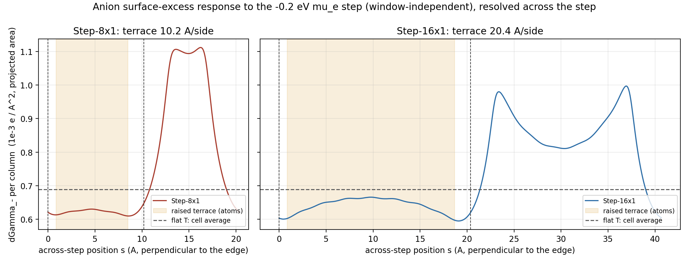
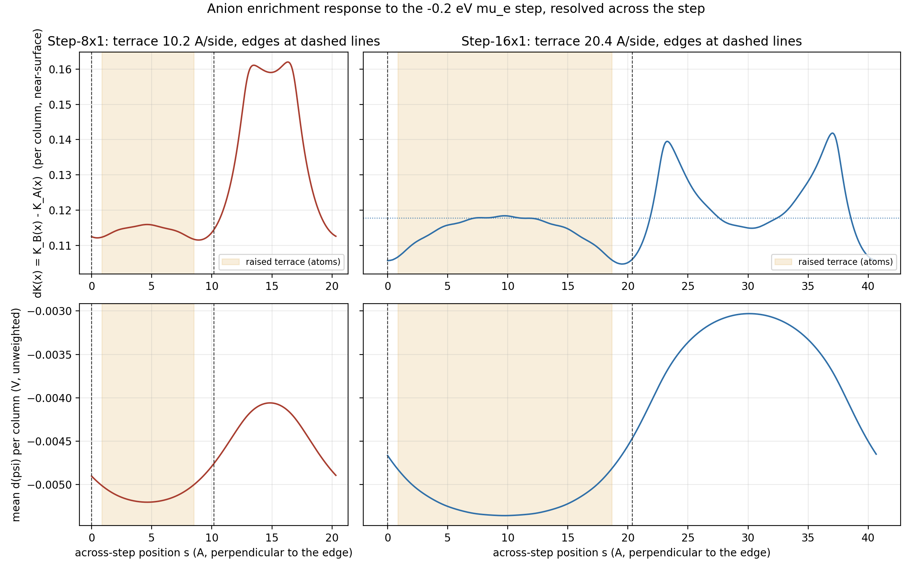
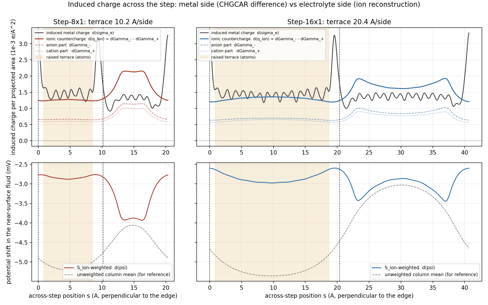

# Step-16×1 at two potentials: terrace-width dependence, and what the "near-edge" statistic was actually measuring

Date 2026-09-26. Runs: `Step-16x1_muref_fastcfg` (TARGETMU = −4.9071, job 20916398) and
`Step-16x1_dUp02_fastcfg` (TARGETMU = −5.1071, job 20916399), both with the adopted
production config (`00_audit/parameter_map.md` §K.8: PREC=Normal, ALGO=Fast, NPAR=16,
16 MPI × 8 OpenMP, FERMICONVERGE=0.01), static, same structure as the earlier Step-16x1
inputs, k-points 1×12×1. TARGETMU is the internal μ₀ reference, not a calibrated V vs RHE.

## 0. Convergence (the question the rerun was meant to answer)

Both runs converged; there was nothing left to diagnose. Every CP round reached
EDIFF = 1e-7 well inside NELM = 200 and the outer loop closed inside FERMICONVERGE.

| run | rounds (SCF steps) | N_e | μ_e (target) | TOTEN (eV) | wall | s/step |
|---|---|---|---|---|---|---|
| Step-16x1_muref_fastcfg | 40 / 76 / 33 = 149 | 792.038710 | −4.907016 (−4.9071) | −220.61924 | 43 min | 15.7 |
| Step-16x1_dUp02_fastcfg | 40 / 71 / 33 = 144 | 791.862697 | −5.107525 (−5.1071) | −219.73559 | 40 min | 15.2 |
| Step-16x1_muref (Accurate/Normal, reference) | 212 | 792.038384 | −4.908008 | −220.64150 | 4 h 00 | 68 |

Against the Accurate reference at the same potential: N_e differs by 3.3e-4 e, TOTEN by
22 meV (0.31 meV/atom, the same PREC-grid offset seen on Step-8x1: 9 meV for 36 atoms),
bulk n_anion/n_bulk 0.9840 vs 0.9836, near-edge/far K_D 0.9838/0.9720 vs 0.9834/0.9718
(Δ ≤ 4e-4). RHOION reconstruction relL2 ~1e-11 on all three runs.

The earlier failure mode (§K.6, first-round SCF wandering to −218.65 eV) did not recur:
both first rounds converged in 40 steps to −220.92 / −219.93 eV. The second-round
charge-sloshing plateau (§K.9) is still there — 48 of 76 steps (muref) and 39 of 71
(dUp02) sat at rms(c) > 0.03 before dropping — but it is now a cost item, not a
convergence failure, and per the 2026-09-26 decision it is not being tuned.

## 1. The same statistic as before: R₁₆ vs R₈

`scripts/step_potential_mechanism.py` (rev 3, run pair from argv; the 8×1 defaults
reproduce rev 2 exactly) applied to the 16×1 pair:

| | ΔK_near | ΔK_far | ratio | (8×1, rev 2) |
|---|---|---|---|---|
| band 2 Å | 0.1089 | 0.1205 | 0.904 | 0.855 |
| band 3 Å | 0.1128 | 0.1205 | **0.936** | **0.868** |
| band 4 Å | 0.1165 | 0.1195 | 0.975 | 0.896 |
| edge1 (u=0), far = common terrace | 0.1113 | 0.1205 | 0.924 | 0.848 |
| edge2 (u=0.5), far = common terrace | 0.1143 | 0.1205 | 0.948 | 0.887 |
| accessibility-relative (per-column window) | 0.1071 | 0.1205 | 0.888 | 0.817 |

K_ij decomposition at 16×1: ΔK_φ = +0.1125 / +0.1203 (near / far), ΔK_S = +0.0002 /
+0.0001 — the response is again entirely the potential-occupation term; the accessibility
field does not change between the two potentials (fixed geometry), as at 8×1.

So the sign is robust (near < far at both widths, every band, each edge), and the ratio
moves toward 1 when the terrace is doubled. Taken alone that reads as "the edge effect
is a fixed-width band that gets diluted in a wider far region". The across-step profiles
below show that this reading is wrong, because the folded near/far split was averaging
over two physically different regions.

## 2. Across-step profiles: the response is a raised/lower-terrace asymmetry, not an edge band

`scripts/step_width_profile.py` and `scripts/step_width_excess.py` resolve the response
per x-column against the true perpendicular position s across the cell (edges at the
dashed lines, raised terrace shaded), instead of folding both sides of both edges onto
one edge distance.

*Fig. 1 — anion surface-excess response ΔΓ₋(s) per projected area to the −0.2 eV μ_e
step, for Step-8x1 (left) and Step-16x1 (right); horizontal dashed line = flat T pair,
cell average.*

*Fig. 2 — same data as the local enrichment response ΔK(s) (the metric used in all
earlier step reports), and the unweighted column-mean potential shift.*

What the profiles show, at both widths:

- Over the **raised terrace** the response is flat and close to the flat-T value
  (ΔΓ₋ = 0.66 at 8×1, 0.68 at 16×1, vs T 0.69 ×10⁻³ e/Ų): 0.96×T and 0.99×T.
- Over the **lower terrace** the response is elevated everywhere: two peaks 4.7 Å
  outward from each upper-edge atom row (16×1: 0.98 and 1.00, i.e. 1.4×T), decaying to a
  trench-centre value that is still 0.81 (1.18×T) ten Å from either riser. At 8×1 the two
  shoulders overlap and merge into a 1.10 (1.6×T) plateau across the whole 10 Å trench.
- The dip at the upper-edge atom row itself (0.60–0.62) is real but 1–2 Å wide.
- The two edges give profiles symmetric to within 0.02 Å in peak position and 2 % in
  height once positions are measured from the atom rows (the nominal grid edge lines
  at u = 0 and 0.5 are offset from the atom rows by 0.85 and 1.7 Å, which is what made
  "edge1" and "edge2" look different in the folded statistic).

The folded 3 Å "near-edge" band therefore contained the raised-terrace edge column
(≈T) plus the steep rise into the trench, and the "far" region contained the raised
interior (≈T) plus the elevated trench. At 8×1 the far strip was in fact the *peak* of
the response (the merged shoulders), which is why R₈ came out lower than R₁₆. Neither
ratio is a property of the step; both are averages over a bimodal profile with weights
set by the terrace width.

## 3. Window-independent footing: surface excess per projected area, against flat T

K_D is a concentration ratio inside a fixed 15 Å window, so its value is diluted by
how much bulk-like accessible fluid the column contains above the local S_ion boundary.
That cancels within one cell but not between cells whose boundaries sit at different
heights (T: metal top 12.20 Å, boundary ≈15 Å; step cells: top 14.60 Å, boundary
17.9–20.6 Å). It is the reason the whole-cell ΔK ordering (T 0.126 > 16×1 0.118) is
inverted relative to the surface-excess ordering below. All cross-cell comparisons here
use ΔΓ₋ = ∫(n₋ − n_b S) dV per projected area, which converges once the window holds
the double layer, and are anchored to the code's own electron count by charge closure.

| pair (−0.2 eV μ_e step) | area (Ų) | ΔN_e | induced σ (10⁻³ e/Ų) | ΔΓ₋ window / full cell | anion share of countercharge |
|---|---|---|---|---|---|
| T_dUp00 → T_dUm02 (Accurate, 3×3×1) | 119.78 | −0.16448 | 1.373 | 0.689 / 0.733 | 0.534 |
| Step-8x1 (Accurate, 2×12×1) | 59.89 | −0.09063 | 1.513 (+10 %) | 0.762 / 0.800 | 0.529 |
| Step-16x1 (Normal, 1×12×1) | 119.78 | −0.17601 | 1.469 (+7 %) | 0.736 / 0.769 | 0.523 |

Charge closure: Σ Δ(n₋ − n₊) dV over the full cell = −ΔN_e to 1.4e-6 (T), 7e-6 (8×1),
2.6e-6 (16×1) relative; the CHGCAR electron counts match the CPM values to 1e-6 e.

Regional means of ΔΓ₋ (10⁻³ e/Ų, window):

| | raised terrace | lower terrace | trench centre (±3 Å) | foot peaks | mean |
|---|---|---|---|---|---|
| Step-8x1 | 0.660 (0.96×T) | 0.943 (1.37×T) | 1.10 (merged) | 1.10, 1.11 | 0.762 |
| Step-16x1 | 0.679 (0.99×T) | 0.866 (1.26×T) | 0.81 (1.18×T) | 0.98, 1.00 | 0.736 |

The stepped cells take 7–10 % more induced charge per projected area than the flat
slab for the same μ_e step, and essentially all of the surplus (and the redistribution)
shows up on the lower terrace.

## 4. Metal side vs electrolyte side

`scripts/step_induced_charge_profile.py` integrates the CHGCAR difference per column
(induced electronic charge on the metal) and the reconstructed ionic countercharge per
column, both per projected area, plus the S_ion-weighted potential shift.

*Fig. 3 — top: induced metal charge (black) and ionic countercharge (colour; anion and
cation parts dashed/dotted); bottom: S_ion-weighted vs unweighted potential shift in
the near-surface fluid.*

- The induced **metal** charge is nearly uniform across both terraces (terrace-centre
  values 1.31–1.42 vs the 1.47–1.51 mean, i.e. 0.87–0.95× — the terrace interiors carry
  slightly *less* than average, not more) and spikes at the upper-edge atom rows. The two edges are **not**
  equivalent on the metal side: the u = 0.5 edge row carries 3.2–3.3 ×10⁻³ e/Ų
  (2.2× the mean), the u = 0 edge row 1.63–1.65 (1.1×). Both edge-top atoms have CN = 7
  with the same first shell (`manifest.json`, edge_classification_status), so the
  difference is second-shell — consistent with the A/B ({100}/{111} microfacet)
  inequivalence of the two strip edges, though which is which is not assigned here.
  Within ±2 Å of the edge rows sits 25 % of the induced charge on 20 % of the width
  (16×1); 48 % on 39 % (8×1).
- The **countercharge** does not follow the spikes locally. Its peaks are displaced
  4.7 Å laterally onto the lower terrace at both edges, with identical height
  (1.92 / 1.93 ×10⁻³ e/Ų at 16×1) — the electrolyte, sitting 5–6 Å out at the
  ion-accessible boundary, does not resolve the edge inequivalence. The lower-terrace
  fluid is simply the closest accessible electrolyte to the edge charge (the trench
  boundary is ~3 Å above the edge-row height, the fluid above the raised terrace ~6 Å).
- Column shares at 16×1: raised-terrace columns are 44 % of the width, carry 43 % of
  the induced metal charge but only 39 % of the ionic countercharge; at 8×1: 38 %
  width, 36 % metal, 31 % ions. At the 16×1 trench centre the metal charge directly
  beneath equals the raised-terrace value (1.38 vs 1.39) while the countercharge above
  it is 21 % higher (1.63 vs 1.35).
- The **S_ion-weighted** potential shift is −2.9 mV over the raised terrace and dips
  to −3.4 mV at the two foot positions (16×1); the unweighted column mean (−5.2 mV
  raised, −3.5 mV lower) is dominated by the S ≈ 0 region and points the wrong way —
  the caveat attached to §5 of the rev-2 mechanism check was warranted. The weighted
  window average still under-represents the trench (its column holds ~2.4 Å more
  bulk-like fluid), so it is a qualitative indicator only.

## 5. What this changes

- **Superseded as the headline:** "the near-edge anion response is ~13–20 % weaker
  than the terrace" (step8x1_potential_response.md, step8x1_ion_species_analysis.md,
  step8x1_mechanism_check.md §5). The numbers in those reports are unchanged and
  reproducible, but the statistic averaged a bimodal profile. The step's effect on the
  potential-driven anion response is: raised terrace ≈ flat surface; lower terrace
  enhanced by 1.2–1.4× (1.6× when the terrace is 10 Å wide), because the excess
  induced charge at the convex upper edges is compensated by ions over the lower
  terrace rather than above the edge. The rev-2 hypothesis "same Δψ, different point on
  the nonlinear occupation curve" is no longer needed to explain anything.
- **Terrace width is not converged at 20 Å.** The trench centre 10 Å from both risers
  is still 1.18×T; the 8×1 trench is one merged shoulder. Any dataset label for a
  "terrace" site must carry the terrace width and which terrace (upper/lower) it sits on.
- **Edge inequivalence is real on the metal side and invisible on the electrolyte
  side** at this model's resolution — a useful fact for how much edge-type labelling
  the ML targets actually need.
- The folded near/far ratio is retired for step cells; the per-column ΔΓ₋(s) profile
  (`step_width_excess.json`) and the metal/ion profiles (`step_induced_charge_profile.json`)
  are the quantities to carry forward.

Caveats that stand: the 16×1 pair is PREC=Normal while the 8×1 and T pairs are
Accurate (config effect on K ≤ 4e-4, on σ untested at 16×1 dUp02); the T reference is
a different cell with a different k-mesh (3×3×1 on 11.76 Å vs 1×12×1 on 47×2.94 Å),
so the +7–10 % σ surplus and the 0.96–0.99×T raised-terrace values are not established
to better than a few per cent; static geometries throughout; one potential step only;
implicit ions with R_ION = 4 Å and a 2 Å Stern layer set the 5–6 Å gap that produces the
lateral displacement.

## 6. Recommended next (nothing submitted)

1. **Flat 16×1 baseline pair** — a 64-atom flat slab in the Step-16x1 cell (same
   1×12×1 k-mesh, PREC=Normal, same window) at both potentials, ~2 × 30 min. Gives
   σ_T and Γ_T on identical numerics, which is what the +7 % and the 0.99×T raised
   terrace are currently compared against.
2. **Step-24x1** (108 atoms, ~1 h per point with the new config) to see whether the
   trench centre approaches the flat value at 15 Å from the risers.
3. Not now: relaxations, kinks, other facets, more potentials.

Files: `scripts/step_potential_mechanism.py` (rev 3), `scripts/step_width_profile.py`,
`scripts/step_width_excess.py`, `scripts/step_induced_charge_profile.py`, outputs
`03_pilot/step_width_profile.json`, `step_width_excess.json`,
`step_induced_charge_profile.json`, figures in `03_pilot/report_assets/batch1/`. All
analysis scripts are launched through `scripts/pyrun.sh` (see its header for why).
