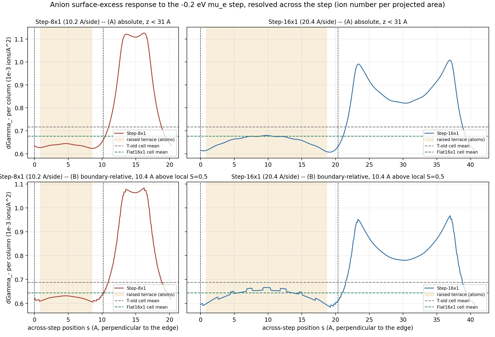
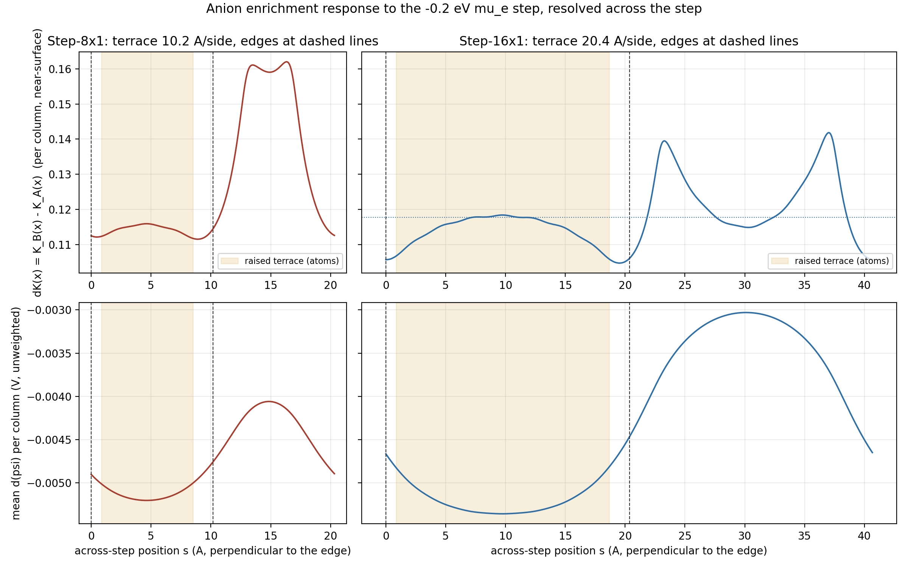
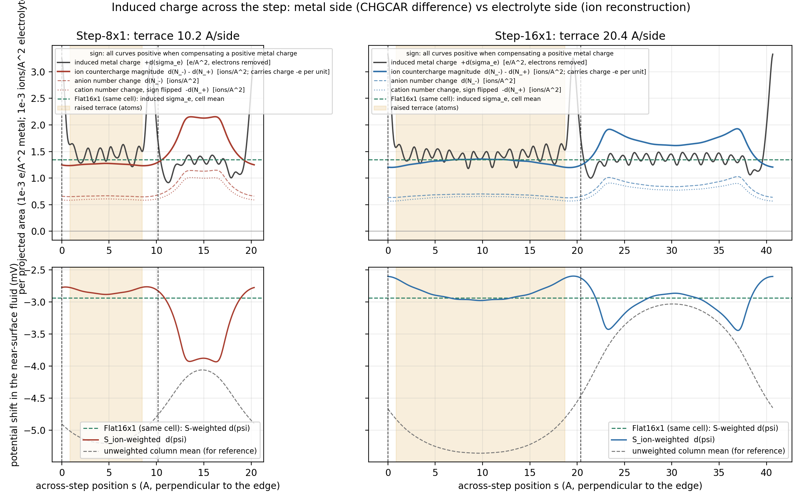

# Step-16×1 at two potentials, with a same-cell flat baseline: what the step does to the potential-driven ion response

Rev 3, 2026-09-27 (rev 1 of 2026-09-26 compared against the old T cell only; rev 2 added
the same-cell flat pair; rev 3 tightens the wording after review — no new data). Runs:

| run | config | rounds (SCF steps) | N_e | μ_e reached (target) | TOTEN (eV) | wall |
|---|---|---|---|---|---|---|
| Step-16x1_muref_fastcfg | production | 40 / 76 / 33 = 149 | 792.038710 | −4.907016 (−4.9071) | −220.61924 | 43 min |
| Step-16x1_dUp02_fastcfg | production | 40 / 71 / 33 = 144 | 791.862697 | −5.107525 (−5.1071) | −219.73559 | 40 min |
| Flat16x1_muref | production | 36 / 75 / 37 = 148 | 704.061404 | −4.906897 (−4.9071) | −195.58009 | 39 min |
| Flat16x1_dUp02 | production | 36 / 62 = 98 | 703.900000 | **−5.098393** (−5.1071) | −194.76924 | 28 min |
| Step-16x1_muref (reference) | pilot (Accurate) | 212 | 792.038384 | −4.908008 | −220.64150 | 4 h 00 |

Production config = `00_audit/parameter_map.md` §K.8 (PREC=Normal, ALGO=Fast, NPAR=16,
16 MPI × 8 OpenMP, FERMICONVERGE=0.01); static geometries; k-points 1×12×1; TARGETMU is the
internal μ₀ reference, not V vs RHE. Flat16x1 = the 64 base atoms of Step-16x1 with the 8
strip atoms removed, cell/coordinates/window/DIPOL/k-mesh/INCAR unchanged
(`scripts/build_flat16x1_pair.py`, validation in `report_assets/batch1/flat16x1_build_validation.json`:
max displacement 0.0, flags preserved, INCAR differs only in SYSTEM).

## 0. Convergence and two bookkeeping facts

All CP rounds of all four production runs reached EDIFF = 1e-7 well inside NELM = 200; the
outer loop closed inside FERMICONVERGE. The second round in this 47 Å cell still spends
40–50 steps on the rms(c) ≈ 0.03–0.09 charge-sloshing plateau (§K.9) in every run — a cost
item, not a convergence failure; per the 2026-09-27 decision it is not being tuned.

1. **The applied potential steps are not identical.** FERMICONVERGE = 0.01 lets the CP
   loop stop up to 10 meV from TARGETMU. The step pairs landed within 0.5 meV of their
   targets (actual steps −0.2005 eV at 16×1, −0.1995 at 8×1), but Flat16x1_dUp02 stopped
   after two rounds at −5.0984 eV — converged within the allowed potential tolerance, not
   unconverged — so the flat pair's actual step is **−0.1915 eV**, 4.5 % smaller. Every
   step/flat ratio below is given raw and *per eV*: each response divided by its own actual
   converged |Δμ_e|, i.e. a finite-difference secant slope χ = [X(U₂) − X(U₁)]/(U₂ − U₁).
   Multiplying a raw ratio by 0.191496/0.200509 = 0.955 gives the per-eV ratio (raw σ ratio
   1.0905 → 1.0415). This corrects the main step-size difference; if the response has
   curvature, dividing by each step does not remove all of the difference, and that
   residual nonlinearity is **not separately quantified here** (no data to bound it). It
   does not create or remove the same-cell spatial structure of §2. A rerun of the one flat
   point with FERMICONVERGE = 0.001 would remove the need for normalisation; deferred (§6).
2. **Neutral electron chemical potentials.** First CP round at the neutral electron
   count, under the common potential reference of this cell: Flat16x1 −4.9792 eV,
   Step-16x1 −4.9507 eV, T-old (4×4 cell, 3×3×1, Accurate) −4.9071 eV. The step raises μ_e of
   the neutral slab by 28.5 meV relative to the same-cell flat slab — the direction
   expected from Smoluchowski smoothing, but stated as a μ_e difference under a common
   reference, not as a vacuum work-function difference (that would need the same-side
   vacuum level, W = E_vac − E_F, which is not extracted here). The 72 meV gap between the
   two flat references is attributable to their different numerical set-ups collectively
   (cell shape, k-mesh, PREC), not decomposed further; it is why T-old could not serve as the
   baseline. The *differential* quantities are much less sensitive (T-old vs Flat16x1: σ per
   eV +2.9 %, ΔΓ₋ per eV −1.0 %).

## 1. The statistic used in the earlier reports: R₁₆ vs R₈

`scripts/step_potential_mechanism.py` (rev 3; 8×1 defaults reproduce rev 2 exactly) on the
16×1 pair, K_D near-edge (<3 Å folded band) vs far:

| | ΔK_near | ΔK_far | ratio | (8×1) |
|---|---|---|---|---|
| band 2 Å | 0.1089 | 0.1205 | 0.904 | 0.855 |
| band 3 Å | 0.1128 | 0.1205 | **0.936** | **0.868** |
| band 4 Å | 0.1165 | 0.1195 | 0.975 | 0.896 |
| edge1 / edge2 (u = 0 / 0.5) | 0.1113 / 0.1143 | 0.1205 | 0.924 / 0.948 | 0.848 / 0.887 |

K_ij decomposition: ΔK_φ = +0.1125 / +0.1203 (near / far), ΔK_S = +0.0002 / +0.0001 — the
response is the potential-occupation term at both widths, as before. The sign (near < far)
is robust, but §2 shows the folded band averages over two physically different regions, so
neither ratio is a property of the step. The numbers were correct; the interpretation of
them as an "intrinsic step response" was not. This statistic is retired for step cells.

## 2. Across-step profiles

`scripts/step_width_excess.py` (rev 3) resolves the anion surface-excess response per
x-column against the perpendicular across-step position s (edges at the dashed lines,
raised terrace shaded), in ion number per projected area:

ΔΓ₋ = (1/A_proj) ∫_Ω [Δn₋ − n_b ΔS_ion] dV  (10⁻³ ions Å⁻²; ×(−e) for the charge density).

ΔΓ₋ is the *change of the anion surface excess* between the two potentials — a response
rate, not a local Cl⁻ concentration, and not an adsorption energy or probability.

*Fig. 1 — ΔΓ₋(s) for Step-8x1 (left) and Step-16x1 (right) under the two integration
conventions of §3; dashed lines: cell means of the flat pairs.*

*Fig. 2 — the same response as the local enrichment ΔK(s) used in the earlier reports,
and the unweighted column-mean potential shift.*

At both widths:

- Over the **raised terrace** the response is flat and *below* the same-cell flat value
  (0.93–0.95× per eV at 16×1; 0.90–0.93× at 8×1).
- Over the **lower terrace** it is elevated everywhere, with two peaks 4.6–4.7 Å outward
  from each upper-edge atom row (16×1: 1.40–1.43× flat per eV) decaying to a trench-centre
  value that is still 1.17× flat ten Å from either riser. At 8×1 the two shoulders merge
  into a 1.6× plateau across the whole 10 Å trench.
- The two edges give profiles symmetric to 0.1 Å in peak position and 2 % in height once
  positions are measured from the atom rows (the nominal grid edge lines are offset from
  the rows by 0.85 and 1.7 Å — the source of the apparent edge1/edge2 difference in §1).
- Null test: the Flat16x1 profile is flat to 0.16 % (std/mean) under the same analysis.

The folded 3 Å "near-edge" band of §1 contained the raised-terrace edge column plus the
steep rise into the trench; the "far" region contained the raised interior plus the elevated
trench. At 8×1 the far strip was the *peak* of the response, which is why R₈ < R₁₆.

## 3. Integration conventions and window (non-)convergence

The response decays with an apparent length of 3.2 Å (≈ the 1 M Debye length) but rides on
a residual far-field potential offset (−0.2 to −0.3 mV at z = 31 Å), so it is **not
window-converged inside the available electrolyte**: the last plane with S_ion = 1
everywhere is z = 31.0 Å (the far artificial ion window starts at 31.3 Å, ION_Z1 = 32.6),
and the integral still grows by 2.6–5.0 % between z_up = 28 and 31 Å (less for the flat
cells, more for the step cells) and by a further 0.5–0.8 % up to 32 Å. Every number here is
therefore the surface excess *within the stated integration range*. Two conventions:

- **(A) absolute**: Ω = {z < 31.0 Å} for every cell. No lower bound is needed (S_ion = 0
  inside the metal; the below-metal contribution is < 1e-29). Columns partition the cell
  total exactly — the convention for totals and closure. Its bias: a column whose
  accessible boundary sits higher (raised terrace, +2.4 Å) keeps less of the tail.
- **(B) boundary-relative**: per column, Ω = {z_b(x) ≤ z < z_b(x) + 10.4 Å}, z_b = local
  S_ion = 0.5 crossing (17.9–20.6 Å in the step cells, 17.9 Å flat). Every column keeps the
  same tail fraction — the convention for regional ratios.

The two conventions agree on all ratios to within 2 %. Two distinctions to keep:
agreement between the conventions is **not** a 2 % error bar — both integrate the same
finite electrolyte slab under the same far window and can share a common bias; and the
tail sensitivity of Γ is a range-selection effect on the *ion* side — it is not an
uncertainty on the induced charge σ, which comes from the self-consistent electron count
and is closed against the ion reconstruction to 1e-6.

| pair (production unless noted) | actual Δμ_e (eV) | ΔN_e | σ (10⁻³ e/Ų) | σ/\|Δμ\| (10⁻³ e/Ų/eV) | ΔΓ₋ (A) | ΔΓ₋ (B) | anion share |
|---|---|---|---|---|---|---|---|
| T-old (4×4, Accurate, 3×3×1) | −0.2008 | −0.16448 | 1.373 | 6.84 | 0.717 | 0.688 | 0.527 |
| **Flat16x1** | −0.1915 | −0.16140 | 1.348 | 7.04 | 0.677 | 0.644 | 0.506 |
| Step-8x1 (Accurate, 2×12×1) | −0.1995 | −0.09063 | 1.513 | 7.59 | 0.776 | 0.751 | 0.521 |
| Step-16x1 | −0.2005 | −0.17601 | 1.470 | 7.33 | 0.748 | 0.719 | 0.516 |

ΔΓ₋ in 10⁻³ ions Å⁻²; anion share = ΔΓ₋/(ΔΓ₋ − ΔΓ₊) over the full cell. Charge closure
Σ Δ(n₋ − n₊) dV = −ΔN_e to ≤ 7e-6 relative in all four pairs; the −n_b ΔS term is 1.5 % of
ΔΓ₋ (kept; S_ion follows the electron density). The plain anion-count change ∫Δn₋/A is
1.4 % larger than ΔΓ₋ and is reported separately in `step_width_excess.json`.

**Step-16x1 relative to Flat16x1, per eV** (raw in parentheses):

| | induced σ | cell mean ΔΓ₋ | raised terrace | lower terrace | trench centre (±3 Å) | foot peaks |
|---|---|---|---|---|---|---|
| (A) | 1.041 (1.091) | 1.056 (1.106) | 0.928 (0.972) | 1.194 (1.250) | 1.175 (1.230) | 1.42, 1.40 (1.49, 1.47) |
| (B) | — | 1.066 (1.117) | 0.948 (0.992) | 1.194 (1.251) | 1.172 (1.227) | 1.43, 1.41 (1.50, 1.48) |

**Step-8x1 relative to Flat16x1, per eV** (different PREC and k-mesh — indicative only):
σ 1.078; cell mean 1.10–1.12; raised 0.90–0.93; lower 1.30–1.32; trench centre 1.50–1.51;
merged trench plateau 1.60–1.61.

Absolute regional values, Step-16x1 (A / B, 10⁻³ ions Å⁻²): raised 0.657 / 0.639, lower
0.845 / 0.806, trench centre 0.832 / 0.791, raised centre 0.676 / 0.659, foot peaks
1.008 & 0.991 / 0.967 & 0.952.

## 4. Metal side vs electrolyte side

`scripts/step_induced_charge_profile.py` integrates the CHGCAR difference per column
(induced electronic charge on the metal) and the reconstructed ionic countercharge per
column, both per projected area, plus the S_ion-weighted potential shift. CHGCAR electron
counts match the CPM values to 1e-6 e; both per-column sums reproduce −ΔN_e.

*Fig. 3 — top: induced metal charge (black, e/Ų) and ion countercharge (colour, ions/Ų;
anion and cation parts dashed/dotted; all plotted positive when compensating a positive
metal charge); green dashed: Flat16x1 cell mean. Bottom: S_ion-weighted vs unweighted
potential shift; green dashed: Flat16x1.*

- The induced **metal** charge is nearly uniform across both terraces (terrace-centre
  values 1.31–1.42 vs the 1.47–1.51 mean, 0.87–0.95×; the flat slab gives 1.35 uniformly)
  and spikes at the upper-edge atom rows. The two edges are **not** equivalent on the metal
  side: the column-integrated profile peaks at 3.2–3.3 ×10⁻³ e/Ų (2.2× the mean) at the
  u = 0.5 edge row and at 1.63–1.65 (1.1×) at the u = 0 edge row. These are peak values of
  an along-edge-averaged density profile, not a charge partitioning onto individual edge
  atoms. Both edge-top atoms have CN = 7 with the same first shell; the electronic response
  is inequivalent, which is compatible with the A/B ({100}/{111} microfacet) inequivalence
  of the two strip edges, but the microfacet assignment is a separate geometric check not
  made here, and CN alone does not locate the origin of the difference. Within ±2 Å of the
  edge rows sits 25 % of the induced charge on 20 % of the width (16×1); 48 % on 39 % (8×1).
- The **countercharge** does not follow the spikes column by column. Its peaks are
  displaced 4.7 Å laterally onto the lower terrace at both edges, with matching height
  (1.92 / 1.93 ×10⁻³ ions/Ų at 16×1): within this model (R_ION = 4 Å, 2 Å Stern layer,
  this potential step, along-edge-averaged profiles) the metal-side edge difference is not
  carried over to the ion-accessible region with anything like the same magnitude. That is
  a statement about this resolution and these parameters, not a general claim that the
  electrolyte cannot distinguish the edges.
- Column shares at 16×1: raised-terrace columns are 44 % of the width, carry 43 % of the
  induced metal charge but 39 % of the ionic countercharge (8×1: 38 % / 36 % / 31 %). At
  the 16×1 trench centre the metal charge beneath equals the raised-terrace value
  (1.38 vs 1.39) while the countercharge above is 21 % higher (1.63 vs 1.35). The spatial
  pattern is *consistent with* the lower-terrace fluid being the closest accessible
  electrolyte to the edge charge (trench boundary ~3 Å above the edge-row height, fluid
  above the raised terrace ~6 Å); charge closure over the cell does not by itself establish
  a one-to-one pairing between a metal region and an ion region.
- The **S_ion-weighted** potential shift is −2.94 mV for the flat slab, −2.87 mV over the
  raised terrace, −3.01 mV over the lower terrace, dipping to −3.4 mV at the two foot
  positions (16×1). The unweighted column mean (−5.2 mV raised, −3.5 mV lower) is dominated
  by the S ≈ 0 region and points the wrong way. The weighted window average still
  under-represents the trench (its column holds ~2.4 Å more bulk-like fluid), so it is a
  qualitative indicator only.

## 5. What this establishes, ordered by strength of evidence

**Better supported (same cell, same numerics, same analysis; independent of the flat
baseline and of the integration convention):**

- Inside the periodic strip model the step *redistributes* the potential-driven ion
  response: the raised terrace responds slightly less, the lower terrace more, and the
  strongest response sits not above the upper-edge atoms but 4.6–4.7 Å outward over the
  lower terrace (§2, §4).
- The induced metal charge concentrates at the upper-edge rows (one edge ~2× the other in
  the along-edge-averaged profile) while the ion-side peaks are laterally displaced and
  edge-symmetric (§4).
- The folded near/far statistic of the earlier reports cannot represent this structure;
  its values were correct but its reading as an "intrinsic step response" is withdrawn
  (step8x1_potential_response.md, step8x1_ion_species_analysis.md,
  step8x1_mechanism_check.md §5 carry superseded notes).

**Needs more qualification before being quoted as a number:**

- The magnitudes against the same-cell flat slab, per eV (Step-16x1): induced σ ≈ +4 %,
  cell-mean ΔΓ₋ ≈ +6 %, raised terrace −5 to −7 %, lower terrace ≈ +19 %, trench centre
  ≈ +17 %, foot peaks +40 to +43 %. Each is conditional on the actual potential intervals
  (§0.1), the integration range (§3), the model parameters, and — for the 8×1 numbers —
  a PREC/k-mesh mismatch. "+40 %" is the change of the anion surface excess per unit
  potential step at those columns, not a 40 % higher local Cl⁻ concentration and not a
  40 % change in Cl adsorption energy or probability.
- The lateral range of the step's influence: the trench centre is still 1.17× flat at
  10 Å from either riser, so 20 Å terraces are not converged toward an isolated step.
  Whether that is two-edge coupling or a longer single-edge range is not separable here.
- Transferability to a real electrolyte: implicit ions with R_ION = 4 Å and a 2 Å Stern
  layer set the 5–6 Å gap that produces the lateral displacement; nothing here concerns
  Cl chemisorption.

**Consequences for the dataset:** a periodic 20 Å (or 10 Å) trench is a legitimate,
fully specified sample and does not need to reach the isolated-step limit first — but its
labels must carry the finite periodic width, the finite electrolyte slab and which terrace
(upper/lower) a site sits on; it must not be read as an isolated step in an infinite
electrolyte. Two principles for the training-data stage: (1) label with the *actual*
converged state — Flat16x1_dUp02 is the state at μ_e = −5.098393 eV, N_e = 703.900000, not
"the −5.1071 eV point"; when charge is the input, use the actual converged electron count;
(2) `run_registry.json` records the configuration version of every run, but recording it
does not remove the PREC-dependent energy offset — energy labels need one consistent
standard, with older PREC=Accurate data kept as traceable references and no unverified
blanket correction.

**Stage summary.** Under fixed geometry, a single-sided continuum electrolyte and the
present finite periodic conditions, a step on the Au strip changes the spatial
distribution of the charging-induced ion response. Relative to the same-cell flat slab,
the raised-terrace response is slightly weakened, the lower-terrace and foot responses are
enhanced, and the ion-response peak is laterally offset from the metal-side induced-charge
peak. The folded near-edge/far-edge index cannot represent this spatial structure; the
position-resolved surface-excess response is the primary analysis quantity. The
enhancement magnitudes remain bounded by the actual potential intervals, the finite
electrolyte region and the periodic width; the results do not bear on Cl chemisorption.

## 6. Deferred options (nothing submitted; none is a prerequisite for the dataset work)

| option | when it becomes worth doing |
|---|---|
| (i) Flat16x1_dUp02 with FERMICONVERGE = 0.001 (~30 min) | when a few-percent same-potential difference (the +4 %/+6 %) is to be reported as a precise headline |
| (ii) Step-24x1, two points (108 atoms, ~1 h each) | when the lateral range / isolated-step limit is itself the question |
| (iii) Flat-8x1 pair (32 atoms, ~10 min each) | when 8×1 vs 16×1 is to be a strict same-configuration width scaling |

The open physical question, now on a controlled footing: why the electronic charging
heterogeneity created by the step (uniform terraces, spikes at the upper-edge rows, one
edge 2× the other) appears in the ion-accessible space as a lower-terrace enhancement
displaced ~4.7 Å from the edge rows rather than as a co-located peak above the edge.

Files: `scripts/build_flat16x1_pair.py`, `scripts/step_potential_mechanism.py` (rev 3),
`scripts/step_width_profile.py`, `scripts/step_width_excess.py` (rev 3),
`scripts/step_induced_charge_profile.py`, `scripts/build_run_registry.py`; outputs
`03_pilot/step_width_profile.json`, `step_width_excess.json`, `step_induced_charge_profile.json`,
`run_registry.{json,md}`, figures in `03_pilot/report_assets/batch1/`. Analysis Python stack
via `scripts/pyrun.sh`: Python 3.9.13 (conda base), numpy 1.21.5, scipy 1.9.1,
matplotlib 3.5.2, ASE 3.23.1b1.
