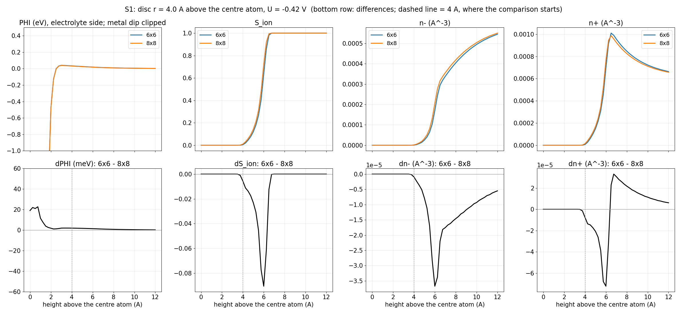
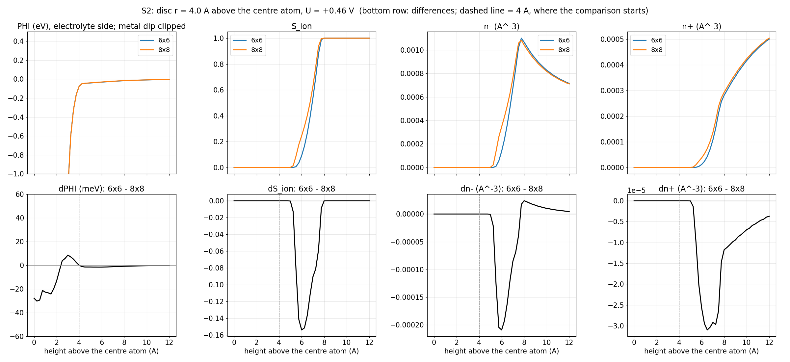
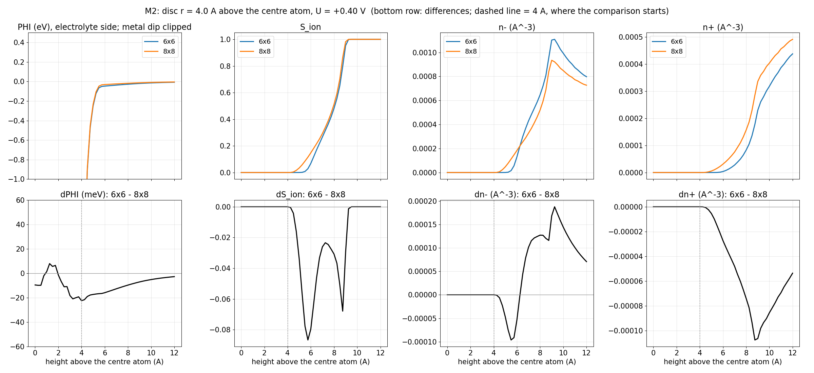
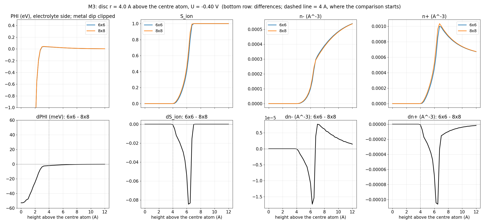

# Size-pair results

## S1 — single-layer step/kink (A, frozen centre PA1_s51_f082500_a3617) (U = -0.42 V)

6x6: complete | 8x8: complete

electrolyte-side differences (z >= 4 A above the centre atom): max |dPHI| 2.0 meV, max |dS_ion| 0.09, max |dn-| 3.7e-05 A^-3 = 7% of the 8x8 peak in the window; Gamma- differs by -3.6%.

matched atoms |C| = 14 (of 163 shared; identical neighbour sets within R_CORE = 6.0 A in both cells); RMS dF = 0.0594 eV/A against RMS |F| = 0.2085 eV/A on the same atoms in the 8x8 (ratio 0.29), max 0.2122 at parent atom 4366 (6.2 A from the nearest 6x6 seam); RMS within 2 rows of a seam 0.0515 (2 atoms) vs interior 0.0607.
Neighbour positions: 1 matched atoms have every neighbour within 6.0 A at the same relative position in both cells (< 0.02 A), RMS dF 0.0484 eV/A; the other 13 have neighbours that the 6x6 seam repair moved (max shift up to 0.30 A), RMS dF 0.0602 eV/A.

| parent atom | layer (6x6) | dist. to 6x6 seam (A) | max neighbour shift (A) | |F| 8x8 (eV/A) | |dF| (eV/A) |
|---|---|---|---|---|---|
| 4366 | 4 | 6.2 | 0.303 | 0.378 | 0.212 |
| 3586 | 3 | 5.6 | 0.135 | 0.198 | 0.174 |
| 1569 | 1 | 6.4 | 0.099 | 0.139 | 0.142 |
| 3618 | 3 | 7.1 | 0.303 | 0.465 | 0.123 |
| 2593 | 2 | 7.2 | 0.303 | 0.251 | 0.099 |
| 4348 | 4 | 4.3 | 0.233 | 0.824 | 0.094 |
| 3617 | 4 | 4.2 | 0.000 | 0.462 | 0.084 |
| 545 | 0 | 5.5 | 0.099 | 0.068 | 0.068 |
| 4364 | 4 | 6.2 | 0.263 | 0.659 | 0.045 |
| 546 | 0 | 7.2 | 0.058 | 0.052 | 0.041 |
| 1570 | 1 | 6.4 | 0.103 | 0.030 | 0.037 |
| 514 | 0 | 5.5 | 0.099 | 0.064 | 0.031 |
| 1601 | 1 | 6.4 | 0.303 | 0.077 | 0.031 |
| 513 | 0 | 5.5 | 0.099 | 0.039 | 0.027 |

sigma 6x6 -4.986 vs 8x8 -5.268 uC/cm2 (supplement); Gamma- 0.00269 vs 0.00279 A^-2; accessible boundary 6.0 vs 6.0 A above the centre.
cost: 6x6 147 SCF steps / 1 CP rounds, SCF 2.27 h, elapsed 2.41 h, non-SCF 0.14 h, MaxRSS 51827784K, output 5.3 GB | 8x8 111 / 1, SCF 6.98 h, elapsed 7.33 h, non-SCF 0.34 h, MaxRSS 117540096K, output 11.2 GB -> 6x6 saves 4.9 node-h on this pair.

## S2 — single-layer island edge (B, frozen centre PB1_s51_f082500_a3929) (U = +0.46 V)

6x6: complete | 8x8: complete

electrolyte-side differences (z >= 4 A above the centre atom): max |dPHI| 1.5 meV, max |dS_ion| 0.154, max |dn-| 2.1e-04 A^-3 = 19% of the 8x8 peak in the window; Gamma- differs by -5.0%.

matched atoms |C| = 17 (of 172 shared; identical neighbour sets within R_CORE = 6.0 A in both cells); RMS dF = 0.0925 eV/A against RMS |F| = 0.3468 eV/A on the same atoms in the 8x8 (ratio 0.27), max 0.4303 at parent atom 4201 (5.5 A from the nearest 6x6 seam); RMS within 2 rows of a seam 0.0000 (0 atoms) vs interior 0.0925.
Neighbour positions: 6 matched atoms have every neighbour within 6.0 A at the same relative position in both cells (< 0.02 A), RMS dF 0.022 eV/A; the other 11 have neighbours that the 6x6 seam repair moved (max shift up to 0.57 A), RMS dF 0.1138 eV/A.

| parent atom | layer (6x6) | dist. to 6x6 seam (A) | max neighbour shift (A) | |F| 8x8 (eV/A) | |dF| (eV/A) |
|---|---|---|---|---|---|
| 4201 | 4 | 5.5 | 0.363 | 0.082 | 0.430 |
| 2970 | 2 | 5.5 | 0.359 | 0.810 | 0.284 |
| 4211 | 4 | 5.5 | 0.290 | 1.066 | 0.263 |
| 4212 | 4 | 5.4 | 0.574 | 0.580 | 0.254 |
| 2969 | 2 | 5.5 | 0.285 | 0.335 | 0.142 |
| 857 | 0 | 5.5 | 0.000 | 0.067 | 0.068 |
| 2937 | 2 | 7.0 | 0.277 | 0.898 | 0.062 |
| 3930 | 3 | 5.8 | 0.277 | 0.711 | 0.059 |
| 3929 | 3 | 5.1 | 0.000 | 0.213 | 0.045 |
| 858 | 0 | 5.5 | 0.000 | 0.061 | 0.035 |
| 4200 | 4 | 7.4 | 0.277 | 1.500 | 0.024 |
| 890 | 0 | 7.2 | 0.000 | 0.079 | 0.018 |
| 1913 | 1 | 6.4 | 0.000 | 0.361 | 0.018 |
| 1914 | 1 | 6.4 | 0.277 | 0.292 | 0.018 |
| 889 | 0 | 5.5 | 0.000 | 0.084 | 0.013 |
| 1946 | 1 | 6.4 | 0.285 | 0.187 | 0.012 |
| 1945 | 1 | 6.4 | 0.216 | 0.097 | 0.011 |

sigma 6x6 4.753 vs 8x8 4.934 uC/cm2 (supplement); Gamma- 0.00477 vs 0.00502 A^-2; accessible boundary 7.0 vs 6.75 A above the centre.
cost: 6x6 152 SCF steps / 1 CP rounds, SCF 2.49 h, elapsed 2.63 h, non-SCF 0.15 h, MaxRSS 50181676K, output 5.3 GB | 8x8 132 / 1, SCF 9.54 h, elapsed 9.89 h, non-SCF 0.35 h, MaxRSS 122922016K, output 11.2 GB -> 6x6 saves 7.3 node-h on this pair.

## M2 — step bunching: middle terrace with both step edges (PM2a_s11 @165 ps, atom 4120) (U = +0.40 V)

6x6: complete | 8x8: complete

electrolyte-side differences (z >= 4 A above the centre atom): max |dPHI| 22.3 meV, max |dS_ion| 0.087, max |dn-| 1.9e-04 A^-3 = 20% of the 8x8 peak in the window; Gamma- differs by +14.4%.

matched atoms |C| = 16 (of 185 shared; identical neighbour sets within R_CORE = 6.0 A in both cells); RMS dF = 0.0304 eV/A against RMS |F| = 0.2925 eV/A on the same atoms in the 8x8 (ratio 0.10), max 0.1029 at parent atom 2789 (7.2 A from the nearest 6x6 seam); RMS within 2 rows of a seam 0.0297 (1 atoms) vs interior 0.0305.
Neighbour positions: 3 matched atoms have every neighbour within 6.0 A at the same relative position in both cells (< 0.02 A), RMS dF 0.0343 eV/A; the other 13 have neighbours that the 6x6 seam repair moved (max shift up to 0.36 A), RMS dF 0.0294 eV/A.

| parent atom | layer (6x6) | dist. to 6x6 seam (A) | max neighbour shift (A) | |F| 8x8 (eV/A) | |dF| (eV/A) |
|---|---|---|---|---|---|
| 2789 | 2 | 7.2 | 0.223 | 0.263 | 0.103 |
| 4120 | 4 | 6.9 | 0.000 | 0.714 | 0.080 |
| 3844 | 3 | 5.2 | 0.258 | 0.483 | 0.068 |
| 740 | 0 | 5.5 | 0.049 | 0.099 | 0.064 |
| 4643 | 5 | 5.4 | 0.057 | 0.537 | 0.056 |
| 4644 | 5 | 5.1 | 0.365 | 1.169 | 0.052 |
| 1764 | 1 | 6.4 | 0.125 | 0.352 | 0.050 |
| 773 | 0 | 7.2 | 0.000 | 0.078 | 0.046 |
| 741 | 0 | 5.5 | 0.006 | 0.060 | 0.046 |
| 1797 | 1 | 6.4 | 0.096 | 0.190 | 0.039 |
| 772 | 0 | 5.5 | 0.125 | 0.030 | 0.037 |
| 3813 | 3 | 5.4 | 0.163 | 0.871 | 0.035 |
| 2790 | 2 | 5.6 | 0.096 | 0.463 | 0.027 |
| 1796 | 1 | 6.4 | 0.223 | 0.431 | 0.026 |
| 1765 | 1 | 6.4 | 0.022 | 0.414 | 0.023 |
| 4150 | 4 | 6.1 | 0.065 | 0.359 | 0.015 |

sigma 6x6 6.135 vs 8x8 5.253 uC/cm2 (supplement); Gamma- 0.00453 vs 0.00396 A^-2; accessible boundary 8.25 vs 8.0 A above the centre.
cost: 6x6 212 SCF steps / 1 CP rounds, SCF 4.0 h, elapsed 4.15 h, non-SCF 0.14 h, MaxRSS 55399724K, output 5.3 GB | 8x8 60 / 1, SCF 4.32 h, elapsed 4.68 h, non-SCF 0.36 h, MaxRSS 125076028K, output 11.2 GB -> 6x6 saves 0.5 node-h on this pair.

## M3 — ridge-top edge facing the valley (PM3a_s11 @165 ps, atom 4672); the valley floor with both walls needs 8x8 and is not pairable (U = -0.40 V)

6x6: complete | 8x8: complete

electrolyte-side differences (z >= 4 A above the centre atom): max |dPHI| 2.0 meV, max |dS_ion| 0.084, max |dn-| 1.7e-05 A^-3 = 3% of the 8x8 peak in the window; Gamma- differs by +0.0%.

matched atoms |C| = 18 (of 199 shared; identical neighbour sets within R_CORE = 6.0 A in both cells); RMS dF = 0.0822 eV/A against RMS |F| = 0.3037 eV/A on the same atoms in the 8x8 (ratio 0.27), max 0.4024 at parent atom 4642 (5.4 A from the nearest 6x6 seam); RMS within 2 rows of a seam 0.0000 (0 atoms) vs interior 0.0822.
Neighbour positions: 1 matched atoms have every neighbour within 6.0 A at the same relative position in both cells (< 0.02 A), RMS dF 0.0224 eV/A; the other 17 have neighbours that the 6x6 seam repair moved (max shift up to 0.31 A), RMS dF 0.0844 eV/A.

| parent atom | layer (6x6) | dist. to 6x6 seam (A) | max neighbour shift (A) | |F| 8x8 (eV/A) | |dF| (eV/A) |
|---|---|---|---|---|---|
| 4642 | 5 | 5.4 | 0.220 | 0.817 | 0.402 |
| 4053 | 3 | 5.6 | 0.262 | 0.243 | 0.247 |
| 2037 | 1 | 6.4 | 0.211 | 0.364 | 0.221 |
| 5122 | 5 | 5.4 | 0.214 | 0.941 | 0.138 |
| 4086 | 3 | 7.1 | 0.220 | 0.424 | 0.127 |
| 2005 | 1 | 6.4 | 0.171 | 0.215 | 0.114 |
| 4641 | 4 | 6.3 | 0.305 | 0.936 | 0.108 |
| 4674 | 4 | 6.2 | 0.220 | 0.732 | 0.105 |
| 4673 | 5 | 5.9 | 0.214 | 0.861 | 0.074 |
| 1014 | 0 | 7.2 | 0.171 | 0.074 | 0.058 |
| 4085 | 3 | 5.4 | 0.289 | 0.342 | 0.057 |
| 2006 | 1 | 6.4 | 0.171 | 0.230 | 0.053 |
| 5121 | 5 | 6.9 | 0.198 | 0.652 | 0.047 |
| 982 | 0 | 5.5 | 0.171 | 0.044 | 0.039 |
| 4672 | 5 | 5.4 | 0.000 | 0.378 | 0.039 |
| 2038 | 1 | 6.4 | 0.220 | 0.321 | 0.038 |
| 981 | 0 | 5.5 | 0.150 | 0.074 | 0.027 |
| 1013 | 0 | 5.5 | 0.150 | 0.049 | 0.017 |

sigma 6x6 -4.645 vs 8x8 -5.209 uC/cm2 (supplement); Gamma- 0.00254 vs 0.00254 A^-2; accessible boundary 6.25 vs 6.25 A above the centre.
cost: 6x6 145 SCF steps / 1 CP rounds, SCF 2.86 h, elapsed 3.01 h, non-SCF 0.15 h, MaxRSS 54391932K, output 5.3 GB | 8x8 253 / 1, SCF 19.06 h, elapsed 19.42 h, non-SCF 0.37 h, MaxRSS 134794788K, output 11.2 GB -> 6x6 saves 16.4 node-h on this pair.

